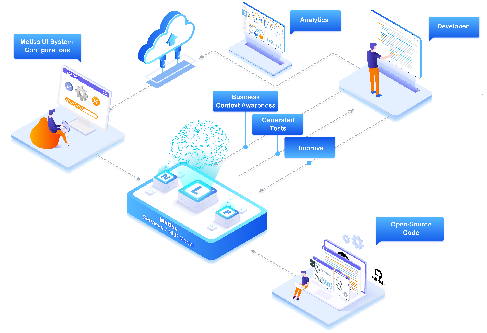

	
	<h2>Eliminating bugs via intelligent test generation</h2>
	

		Metiss is a self-hosted open-source solution that understands the business context of your software and automatically generates tests for it
	

	

		
		
		
		
	

	 
	

		<h2>Get to know us better</h2>
		<ul>
			<li>We're a group of developers trying to solve a painful problem we have</li>
			<li>We believe in the open source and open startups communities</li>
			<li>We're currently raising our seed round</li>
			<li>We'd love your support and contribution to this project, so we'd all enjoy delivering features faster - so star us and join our discord community</li>
			<li>You can always reach our us at <a href="https://twitter.com/metissio">@metissio</a> or directly at <a href="https://twitter.com/elonsalfati">@elonsalfati</a></li>
		</ul>
	

	 
	

